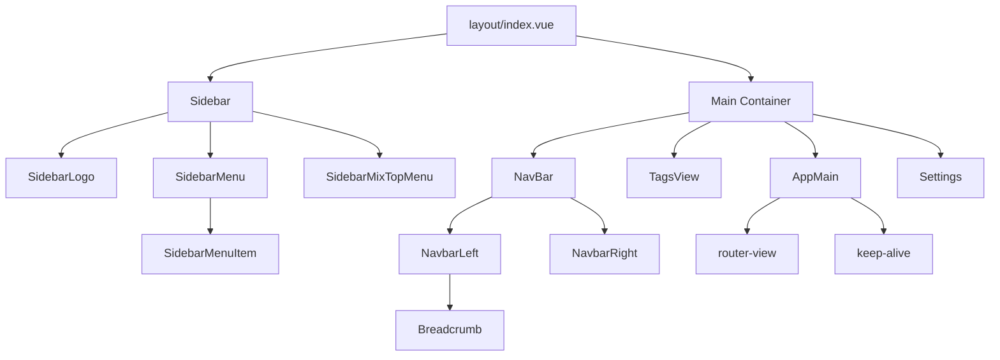

# 阶段一：系统 UI 架构现状分析

## 1. 分析目标

本报告基于当前 `Vue 3 + TypeScript + Element Plus` 项目源码，对系统 UI 架构进行静态分析，重点覆盖以下内容：

- 整体布局结构
- 全局样式组织方式
- 公共组件封装能力
- Element Plus 使用现状
- 当前 UI 主要问题与后续改造方向

说明：

- 本次仅做分析，不改动现有业务代码
- 结论来自对 `src/layout`、`src/styles`、`src/shared`、`src/common`、`src/components`、`src/views` 的实际检索
- 报告目标是为后续 UI 统一改造、Design Token 建设、公共组件治理提供基础判断

---

## 2. 当前 UI 架构总结

当前系统 UI 不是“纯页面手写样式”模式，而是已经形成了一套较明显的三层结构：

### 2.1 外壳层

由 `src/layout` 负责全局框架，承接：

- 顶部导航
- 左侧菜单
- 标签页
- 面包屑
- 主内容区
- 多布局模式切换

这一层已经具备完整后台框架能力，是当前系统最成熟的 UI 结构部分。

### 2.2 业务装配层

由 `src/shared` 与 `src/common/dzmodel` 中的通用组件负责，典型代表：

- `app-table`
- `app-free-edit`（实际承担 `app-form` 职责）
- `ComDialog`（实际承担 `app-dialog` 职责）
- `dynamic-form`
- `rt-*` 系列表单/表格子组件

这一层的特点是：不是直接大量手写原生 `el-form / el-table`，而是通过配置驱动的方式进行二次封装，复用度较高。

### 2.3 样式基座层

由 `src/styles` 提供：

- 全局 reset 与页面基础容器
- CSS Variables
- SCSS 变量
- Element Plus 覆盖样式
- 动态表单皮肤层

这一层已经有“主题变量 + 组件覆盖”的雏形，但职责边界还不清晰，存在重复与污染。

---

## 3. Layout 分析

## 3.1 目录结构

`src/layout` 当前结构如下：

```text
src/layout
├─ index.vue
└─ components
   ├─ AppMain
   ├─ CopyRight
   ├─ NavBar
   │  └─ components
   │     ├─ NavbarLeft.vue
   │     └─ NavbarRight.vue
   ├─ Settings
   ├─ Sidebar
   │  └─ components
   │     ├─ SidebarLogo.vue
   │     ├─ SidebarMenu.vue
   │     ├─ SidebarMenuItem.vue
   │     ├─ SidebarMenuItemTitle.vue
   │     └─ SidebarMixTopMenu.vue
   └─ TagsView
```

相关但不在 `src/layout` 目录内的布局关联组件：

- `src/components/Breadcrumb/index.vue`
- `src/router/index.ts`
- `src/store/modules/app.ts`
- `src/store/modules/settings.ts`
- `src/store/modules/permission.ts`
- `src/store/modules/tagsView.ts`

## 3.2 当前布局关系图



## 3.3 布局组织方式

布局总入口是 `src/layout/index.vue`，通过 `settingsStore.layout` 支持三种模式：

- `left`
- `top`
- `mix`

当前实现特点：

- `Sidebar` 始终挂载，但在不同布局下承担不同角色
- `mix` 模式为“顶部主菜单 + 左侧二级菜单 + 内容区”
- `left` 模式为“左侧导航 + 顶部导航 + 标签页 + 内容区”
- `top` 模式为“顶部菜单 + 标签页 + 内容区”
- `AppMain` 统一承接 `router-view` 与 `keep-alive`
- 标签页与面包屑都依赖路由信息和 Store 联动

## 3.4 顶部导航

顶部导航由以下组件组成：

- `src/layout/components/NavBar/index.vue`
- `src/layout/components/NavBar/components/NavbarLeft.vue`
- `src/layout/components/NavBar/components/NavbarRight.vue`

当前特征：

- `NavbarLeft` 主要负责侧栏收起按钮和面包屑
- `NavbarRight` 承担用户操作区、快捷能力与布局右上角交互
- 导航栏在视觉上已开始统一玻璃化/浅阴影风格

判断：

- 顶部导航结构较清晰
- 但 `top` / `mix` / `left` 三种模式下的显隐策略仍分散在布局入口和侧栏组件内部

## 3.5 左侧菜单

核心文件：

- `src/layout/components/Sidebar/index.vue`
- `src/layout/components/Sidebar/components/SidebarMenu.vue`
- `src/layout/components/Sidebar/components/SidebarMenuItem.vue`
- `src/layout/components/Sidebar/components/SidebarMixTopMenu.vue`

当前特征：

- 菜单数据来自 `permissionStore.routes`
- 混合模式下左侧菜单来自顶级菜单对应的 `children`
- 支持递归菜单树、隐藏路由、单子节点折叠展示
- 支持快捷菜单和系统菜单下拉能力

判断：

- 导航功能完整
- 但 `Sidebar` 本身承担职责偏多，同时兼顾菜单容器、快捷菜单、顶部导航内容、用户区，组件体量偏重

## 3.6 内容区域

内容区域核心由以下部分构成：

- `src/layout/index.vue`
- `src/layout/components/AppMain/index.vue`

当前特征：

- 内容区使用 `keep-alive` 缓存页面
- 缓存范围由 `tagsViewStore.cachedViews` 控制
- 页面实例切换依赖路由中的 `componentKey`

判断：

- 对复杂业务页较友好
- 与标签页、路由 query、缓存策略耦合较深，后续若做页面容器统一改造，需要谨慎处理

## 3.7 标签页

核心文件：

- `src/layout/components/TagsView/index.vue`
- `src/store/modules/tagsView.ts`

当前特征：

- 支持 visitedViews 和 cachedViews 双状态管理
- 支持 affix 固定标签
- 支持关闭当前、关闭左右、关闭其他、关闭全部
- 支持从路由参数读取 `title` 动态覆盖标题

判断：

- 已形成稳定模式
- 与项目“通过路由 title 控制标题/面包屑”的使用习惯一致
- 这是后续统一页面多模式标题控制的重要基础

## 3.8 面包屑

核心文件：

- `src/components/Breadcrumb/index.vue`
- `src/layout/components/NavBar/components/NavbarLeft.vue`

当前特征：

- 面包屑通过 `route.matched` 动态生成
- 支持根据 `meta.breadcrumb === false` 过滤节点
- 支持通过 `redirect` 或 path 编译进行跳转

判断：

- 实现标准，逻辑清晰
- 但面包屑入口主要挂在 `left` 布局下，`top` / `mix` 模式的一致性不足

## 3.9 Layout 涉及组件文件

- `src/layout/index.vue`
- `src/layout/components/AppMain/index.vue`
- `src/layout/components/NavBar/index.vue`
- `src/layout/components/NavBar/components/NavbarLeft.vue`
- `src/layout/components/NavBar/components/NavbarRight.vue`
- `src/layout/components/Sidebar/index.vue`
- `src/layout/components/Sidebar/components/SidebarLogo.vue`
- `src/layout/components/Sidebar/components/SidebarMenu.vue`
- `src/layout/components/Sidebar/components/SidebarMenuItem.vue`
- `src/layout/components/Sidebar/components/SidebarMenuItemTitle.vue`
- `src/layout/components/Sidebar/components/SidebarMixTopMenu.vue`
- `src/layout/components/TagsView/index.vue`
- `src/components/Breadcrumb/index.vue`
- `src/store/modules/app.ts`
- `src/store/modules/settings.ts`
- `src/store/modules/permission.ts`
- `src/store/modules/tagsView.ts`
- `src/router/index.ts`

## 3.10 Layout 优化建议

- 将 `Sidebar/index.vue` 职责拆分为“导航容器层”和“业务菜单扩展层”
- 将 `left/top/mix` 三种模式的差异逻辑进一步集中，避免分散在多个组件内部判断
- 补齐 `top` / `mix` 模式下的面包屑呈现策略，提升一致性
- 将布局相关视觉变量继续沉淀为 Layout Token，而不是在组件内混用局部样式和变量
- 预留 Page Layout 组件层，承接页面内部结构统一，而不是只统一外壳

---

## 4. 全局样式分析

## 4.1 主要样式文件

当前 `src/styles` 的关键文件包括：

- `src/styles/index.scss`
- `src/styles/variables.scss`
- `src/styles/custom-index.scss`
- `src/styles/variables.module.scss`
- `src/styles/reset.scss`

在 `src/main.ts` 中的样式入口如下：

- `element-plus/theme-chalk/dark/css-vars.css`
- `src/styles/index.scss`
- `uno.css`
- `animate.css`

## 4.2 样式组织方式

当前项目样式组织方式属于“混合模式”：

- 一部分通过全局 SCSS class 控制
- 一部分通过 CSS Variables 控制
- 一部分通过 SCSS 变量桥接
- 一部分通过页面内 `<style scoped>` 或内联样式处理
- 一部分直接覆盖 Element Plus 类名

这说明系统已经有主题化意识，但尚未形成完整 Design System。

## 4.3 variables 分析

`src/styles/variables.scss` 当前同时承担了四类职责：

- 设计变量定义
- 主题变量定义
- Layout 变量定义
- Element Plus 全局覆盖

例如当前已经存在：

- 表单字体和尺寸变量
- Dashboard 专用变量
- Layout / Navigation 专用变量
- 明暗主题变量
- 菜单 hover / active 变量

判断：

- 优点是变量化已经启动
- 问题是职责过多，单文件过重，不利于后续治理

## 4.4 theme 现状

当前项目没有独立的 `theme/` 目录。

主题相关逻辑分散在以下位置：

- `src/styles/variables.scss`
- `src/store/modules/settings.ts`
- `src/App.vue`
- 布局组件局部样式

判断：

- 当前有主题机制，但没有清晰的主题分层结构
- 还不适合直接称为完整 Theme System

## 4.5 Element Plus 覆盖方式

当前 Element Plus 覆盖来源较多：

- `dark/css-vars.css`
- `variables.scss` 中的变量与类覆盖
- `index.scss` 中的全局类覆盖
- `custom-index.scss` 中对表单和表格控件的大量统一皮肤处理
- 个别页面内的局部覆盖

判断：

- 已经形成“全局覆盖 + 业务皮肤”的实际运行模式
- 但入口过多，后续维护难度较高

## 4.6 是否存在重复 CSS

存在，且比较明显，主要体现在：

- 多个主题块中重复定义近似变量，仅颜色值不同
- 锚点导航样式在多个业务页面重复复制
- 业务标题条样式多处重复
- `custom-index.scss` 中 mixin 已定义，但在多个层级重复铺开
- 页面内部重复覆盖 `.app-container`、卡片、表单项、输入框样式

## 4.7 是否存在全局污染

存在，主要体现在：

- 直接全局覆盖 `.el-menu-item:hover`
- 直接全局覆盖 `.el-menu-item.is-active`
- 直接修改 `.el-form-item__error`
- 直接修改 checkbox disabled 状态表现
- 使用无容器前缀的 Element Plus 选择器
- 在 `App.vue` 中存在全局字体与滚动条控制

判断：

- 全局污染不是偶发，而是当前样式组织的一部分
- 如果继续扩展页面，会放大样式联动风险

## 4.8 是否适合建立 Design Token

适合，而且当前已经具备基础条件。

原因：

- 已经大量使用 CSS Variables
- Layout 变量已经有独立命名
- 表单尺寸与字体已有统一变量
- 主题切换已有运行时入口

当前最适合建立的 Token 层级：

- 品牌色 Token
- 文本色 Token
- 边框 Token
- 背景/Surface Token
- Layout Token
- 表单尺寸 Token
- 状态色 Token
- Element Plus 映射 Token

## 4.9 全局样式优化建议

- 拆分 `variables.scss` 为 `tokens`、`themes`、`element-overrides` 三层
- 给 Element Plus 全局覆盖增加业务容器前缀或布局容器前缀，减少污染
- 把重复锚点导航、分组标题、表单皮肤抽为公共样式模块或组件
- 统一清理页面中的内联样式，转为 class 和 token 消费
- 将 `@import` 逐步收敛到 `@use`

---

## 5. 公共组件分析

## 5.1 核心公共组件范围

本次重点关注：

- `app-table`
- `app-form` 对应实现
- `app-dialog` 对应实现
- 页面布局类组件

需要说明：

- 当前项目中没有名为 `app-form.vue` 的组件
- 实际承担该职责的是 `src/shared/app-free-edit.vue`
- 当前项目中没有名为 `app-dialog.vue` 的组件
- 实际承担该职责的是 `src/common/dzmodel/ComDialog.vue`

## 5.2 app-table

核心文件：

- `src/shared/app-table.vue`
- `src/shared/app-table-config.ts`

当前封装能力：

- 表头标题栏
- 标题区按钮
- 表内按钮
- 表格数据承载
- 分页
- 行点击
- 选中回调
- 状态变化回调
- 底部按钮区
- 内嵌查询表单能力

判断：

- 封装能力较强
- 已经是标准列表装配组件
- 但“内嵌查询表单”与 `app-free-edit` 存在职责重叠

## 5.3 app-form

实际核心文件：

- `src/shared/app-free-edit.vue`
- `src/shared/dynamic-form.vue`
- `src/shared/app-free-edit-config.ts`

当前封装能力：

- 标题栏
- 顶部按钮
- 底部按钮
- 折叠/展开
- 高级表单区
- schema 驱动表单渲染
- 表单赋值、取值、校验、禁用控制
- 局部字段联动与动态规则处理

判断：

- 当前项目中封装能力最强的公共组件之一
- 已经具备“表单平台层”雏形
- 适合作为后续统一表单规范改造的核心入口

## 5.4 app-dialog

实际核心文件：

- `src/common/dzmodel/ComDialog.vue`
- `src/common/dzmodel/ComDialogConf.ts`
- `src/common/dzmodel/dzmodel.ts`

当前封装能力：

- 动态挂载业务组件
- 统一弹窗容器
- 统一传递数据和方法
- 支持按组件名打开业务弹窗

判断：

- 更偏“动态弹窗容器”
- 适合快速复用
- 类型能力较弱，标准化程度不如表单和表格体系

## 5.5 页面布局组件

页面级布局目前主要有两类：

- 全局布局壳：`src/layout/*`
- 页面业务容器：`.app-container`、卡片容器、自定义锚点侧栏、自定义内容区

判断：

- 全局外壳统一得不错
- 页面内部布局还没有形成真正的 Page Layout 组件层
- 像复杂配置页、详情页、左右联动页，仍大量依赖页面自行组织结构

## 5.6 当前封装能力总结

整体来看，项目已经形成以下封装特征：

- 表单封装强
- 表格封装中强
- 弹窗封装中等
- 页面内部布局封装偏弱
- 组件注册方式偏全局插件化

## 5.7 可优化点

- 统一组件命名口径，解决 `app-form` 实际为 `app-free-edit` 的认知偏差
- 修复配置默认值大量使用 `||` 带来的显式 `false` 失效问题
- 拆开 `app-table` 中与查询表单重叠的能力
- 增强 `ComDialog` 类型约束、footer 规范、提交态规范
- 抽象 `PageSearchLayout`、`PageDetailLayout`、`AnchorDetailLayout` 等页面布局组件

## 5.8 是否可以统一修改

可以，而且很适合分层治理。

建议改造顺序：

- 先改样式 token 与容器规范
- 再改公共表单与表格组件的视觉统一
- 最后推进页面布局组件抽象

原因：

- `app-free-edit`、`app-table` 覆盖面大，统一修改收益高
- 页面内部布局尚未统一，需要先形成标准模板再推动替换

---

## 6. Element Plus 使用情况分析

## 6.1 总体结论

当前项目的 Element Plus 使用非常集中，已经形成稳定模式：

- `el-form` + `el-input` 负责查询/录入
- `el-button` 负责操作触发
- `el-table` 负责列表承载
- `el-dialog` 负责新增/编辑/选择/关联等弹窗动作
- `el-menu` 主要服务布局导航

这是一套典型后台管理系统 UI 范式。

## 6.2 el-table

现状：

- 使用广泛，但不少场景已被 `app-table` / `rt-table` 包装
- 主要用于系统管理页、配置清单页、清单弹窗页

问题：

- 表格样式统一性依赖封装和业务局部覆盖共同完成
- 行内操作区按钮规范仍有散点差异

建议：

- 统一表格头、行高、空态、操作列、分页样式
- 将表格的“查询区 + 列表区 + 操作区”规范彻底收敛到统一模式

## 6.3 el-form

现状：

- 原生用法与 schema 驱动用法并存
- 大量场景经由 `dynamic-form` 间接渲染

问题：

- 原生 `el-form` 与动态表单样式表现不完全一致
- label 宽度、校验提示、间距策略存在局部差异

建议：

- 建立统一的 Form Spec
- 统一 label、间距、校验、禁用态、必填态样式

## 6.4 el-button

现状：

- 是使用最广的 Element Plus 组件
- 原生按钮、link 按钮、封装按钮并存

问题：

- 按钮层级、尺寸、图标间距、危险态/次要态规范不完全统一
- 行内按钮与页头按钮视觉语言不完全一致

建议：

- 建立按钮层级体系
- 用公共按钮配置统一主按钮、次按钮、文本按钮、危险按钮

## 6.5 el-dialog

现状：

- 使用频繁
- 一部分直接页面内写 `el-dialog`
- 一部分走 `ComDialog`

问题：

- 弹窗尺寸、头部、底部按钮、滚动区、关闭策略缺少统一规范
- 类型与生命周期处理不够统一

建议：

- 建立 Dialog Spec
- 明确 `小/中/大/全屏` 四类弹窗规范
- 统一 footer、正文滚动容器、关闭行为

## 6.6 el-menu

现状：

- 主要集中在布局和少量左侧配置导航

问题：

- 主题色、hover、active 状态较多依赖全局覆盖
- 组件级状态与主题 token 还未完全解耦

建议：

- 以 Layout Token 统一菜单视觉
- 避免继续通过全局类名直接硬改

## 6.7 el-input

现状：

- 在表单体系中高频使用
- 相当一部分输入能力已进入 `rt-input` 之类的二次封装

问题：

- 原生输入框与二次封装输入框外观可能不完全一致
- 只读、禁用、必填背景等表现依赖较多定制样式

建议：

- 将输入框尺寸、圆角、字号、禁用态、只读态统一为表单 token
- 将输入类组件作为首批统一优化对象

## 6.8 哪些组件需要统一优化

优先级建议如下：

1. `el-form`
2. `el-input`
3. `el-button`
4. `el-table`
5. `el-dialog`
6. `el-menu`

排序原因：

- 前四者是业务页面最核心的 UI 主链路
- `el-dialog` 是高频交互容器
- `el-menu` 主要影响布局层，虽然关键，但使用面更集中

---

## 7. 当前存在的问题

综合判断，当前系统 UI 的主要问题如下：

### 7.1 优点

- Layout 外壳已经较完整
- 标签页、面包屑、菜单、缓存机制成熟
- 已具备公共表单/表格/弹窗封装基础
- 已开始使用 CSS Variables
- 已具备明暗主题和多主题切换基础能力

### 7.2 核心问题

- 样式职责混杂，`variables.scss` 过重
- Element Plus 覆盖入口过多
- 存在明显的全局污染
- 重复 CSS 较多
- 公共组件命名与职责边界不够清晰
- 页面内部布局未标准化
- 弹窗规范化不足
- 原生组件与封装组件并行，视觉一致性存在风险

### 7.3 根因判断

当前 UI 问题不是“没有架构”，而是“架构已形成，但缺少统一治理层”。

具体表现为：

- 有变量，但还不是完整 Token 体系
- 有封装，但还未形成 Design System
- 有主题，但还未形成 Theme 分层
- 有布局壳，但页面内部布局仍依赖页面自行实现

---

## 8. 推荐优化方案

## 8.1 总体策略

建议采用“先基座、再组件、后页面”的改造方式，而不是直接按页面散点优化。

推荐顺序：

1. 统一设计 Token
2. 收敛全局样式与 Element Plus 覆盖
3. 统一公共组件视觉规范
4. 抽象页面布局模板
5. 批量替换重点业务页面

## 8.2 Design Token 方案

建议建立以下层级：

- Foundation Token：颜色、字号、圆角、阴影、间距
- Semantic Token：文本、边框、背景、状态色
- Layout Token：导航、菜单、标签页、面包屑、内容区
- Form Token：输入框高度、label、必填、错误态、禁用态
- Table Token：表头、行高、hover、选中态、分页
- Dialog Token：头部、正文、footer、尺寸

## 8.3 全局样式治理方案

- 拆分主题、变量、覆盖文件
- 建立“允许全局”和“必须局部”的边界
- 给 Element Plus 覆盖增加作用域
- 清理页面级重复样式块
- 禁止新增无容器前缀的框架覆盖样式

## 8.4 公共组件治理方案

- 统一 `app-free-edit`、`app-table`、`ComDialog` 的命名口径与设计文档
- 把视觉规范尽量下沉到组件层，而不是页面内单独修
- 将复杂页面常见布局抽成标准模板
- 明确“哪些场景必须用封装组件，哪些场景允许原生组件”

## 8.5 页面治理方案

- 优先治理高复用、高曝光、结构相似的页面
- 从通用容器、搜索区、详情区、弹窗区切入
- 避免一上来改最复杂的业务页

---

## 9. 分阶段改造计划

## 阶段 1：基座治理

目标：

- 建立 Token 体系
- 梳理主题结构
- 收敛全局覆盖

输出物：

- `tokens`
- `themes`
- `element-overrides`
- 全局容器规范

验收标准：

- 样式变量分层清晰
- 新增主题不再需要复制大段旧变量
- Element Plus 全局覆盖数量明显下降

## 阶段 2：公共组件统一

目标：

- 统一表单、输入、按钮、表格、弹窗视觉规范

重点对象：

- `app-free-edit`
- `dynamic-form`
- `app-table`
- `rt-input`
- `ComDialog`

验收标准：

- 同类页面组件视觉一致
- 表单/表格/弹窗的间距、尺寸、状态样式统一
- 页面内临时覆写显著减少

## 阶段 3：页面布局模板化

目标：

- 抽象内部页面布局层

建议沉淀的模板：

- `PageSearchLayout`
- `PageDetailLayout`
- `PageCardSection`
- `PageAnchorLayout`
- `PageDialogLayout`

验收标准：

- 新页面不再手工拼接相似布局
- 复杂详情页具备统一骨架

## 阶段 4：重点业务页面迁移

目标：

- 选择高价值页面进行模板替换和样式统一

优先对象：

- 系统管理类页面
- 配置类表单页
- 典型弹窗页
- 左右锚点结构的复杂配置页

验收标准：

- 重点页面视觉一致性明显提升
- 样式重复代码减少
- 页面级临时 patch 明显下降

## 阶段 5：规范沉淀

目标：

- 把 UI 改造成果固化为研发规范

输出物：

- 组件使用规范
- 页面布局规范
- Token 使用规范
- Element Plus 使用约束

验收标准：

- 新增页面默认走统一规范
- 后续样式优化不再回到散点治理模式

---

## 10. 建议的近期执行顺序

如果要开始进入真正改造，建议先从以下顺序启动：

1. `src/styles/variables.scss` 拆层
2. 统一 `src/styles/index.scss` 与 `src/styles/custom-index.scss`
3. 统一 `app-free-edit` / `app-table` 的视觉规范
4. 统一 `el-dialog` 与 `ComDialog` 规范
5. 抽取页面内部布局模板

这样做的收益是：

- 修改面广，但风险可控
- 可以先统一基础视觉语言
- 后续业务页面迁移成本最低

---

## 11. 结论

当前项目的 UI 架构总体上已经具备较好的基础：

- 布局外壳成熟
- 公共组件体系存在
- 主题变量已有雏形
- Element Plus 已形成稳定使用范式

但同时也进入了一个典型的“需要治理升级”的阶段：

- 样式系统从“可用”走向“可维护”的门槛已经出现
- 公共组件从“能复用”走向“强规范”的需求已经明确
- 页面内部结构从“页面自定义”走向“模板化”的时机已经成熟

因此，当前最合理的方向不是继续页面级零散美化，而是正式进入 UI 基座治理阶段。

